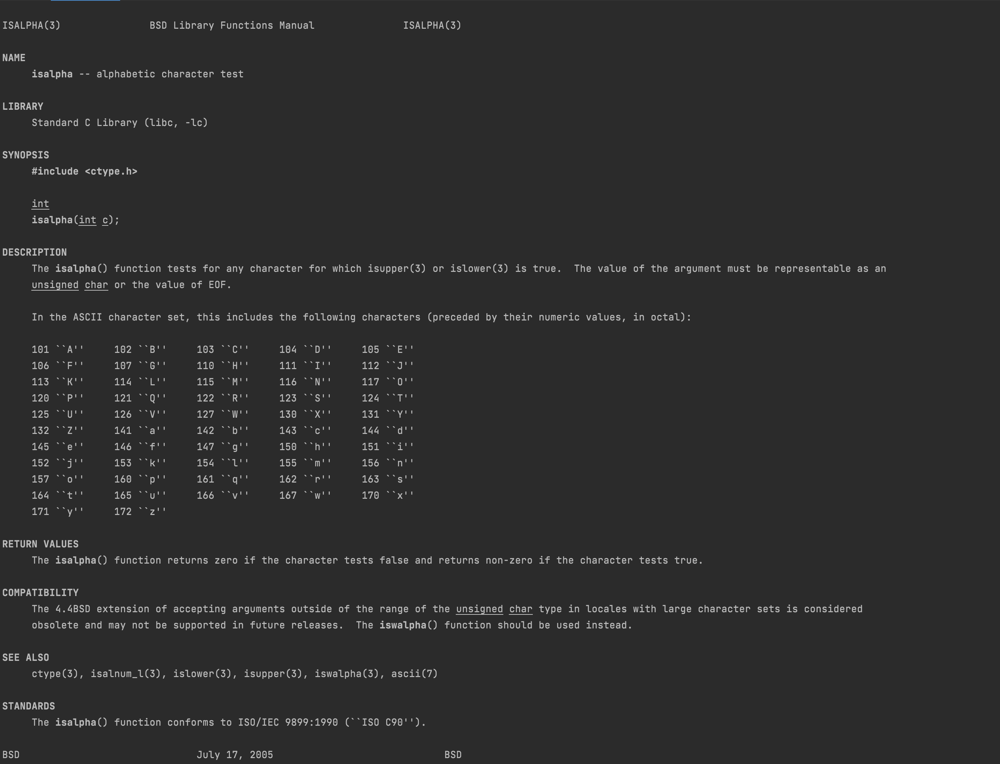

# Libft_extended

The Libft_extended project aims to create a library with useful resources
to make the [42 School](https://42.fr/en/homepage/) cursus a bit simpler,
due to it not only giving you the original Libft project functions, but a
whole set of new functions based on the experience and problems that some
students have faced during this time.

## Table of content
- [Libft_extended](#libft_extended)
- [Table of content](#table-of-content)
- [Original Libft](#1-original-libft)
  - [Some C language basic functions](#11-some-c-language-basic-functions)
  - [Basic malloc functions](#12-basic-malloc-functions)
      - [Malloc and it's use](#121-malloc-and-its-use)
  - [Additional Libft functions](#13-additional-libft-functions)

//////////////WIP TABLE OF CONTENT /////////////////////

## 1. Original Libft


Libft is the first 42 school project from the common core. In this project,
you will create your first library in the [C](https://en.wikipedia.org/wiki/C_(programming_language))
programming language.

### 1.1. Some C language basic functions
The first part asks you to recreate a set of basic C functions. 


you can check up how any of this functions work using the bash
`man` command, for example, if we type `man isalpha` on the terminal,
it will then open a manual page that displays the following information:



As we can see, there are three key concepts on the manual pages:
1. **SYNOPSIS**: This little section tells us how we should declare the
function and what parameters it should receive and return.
2. **DESCRIPTION**: A basic description of what the function does.
3. **RETURN VALUES**: The value the function will return, including error control 
and undefined behaviours.

With this on mind, we can start coding the first part of the Libft project until
we reach calloc, where we encounter our first malloc function.

###1.2. Basic malloc functions 
After finishing the first part, now we face two new functions.

For the purpose of creating this functions, we will now use the `malloc()`
function, wich let us allocate memory for later use.
- ### 1.2.1. Malloc and it's use

C language has not the resources of some modern programming languages where you don't
need to take care of memory allocation, in C, you need to reserve the memory your program
is going to use and free it later. This is where the `malloc` function comes handy,
this function allocates the number of bytes you tell him for your program to use, for example,
if we wanted to create a string with a name on it, and we need to store it for whatever reason,
we could allocate it like this:

```
int main(void)
{
    char *a_name;
    a_name = (char *)malloc(5);
    
    a_name = "Josh";
    return (0);
}
```
As you can see in the code above, we create a pointer to a character, and then we tell it that it's
equal to `(char *)malloc(5)`, meaning that we are telling the computer we need 5 bytes of memory.
We also use the `(char *)` cast to tell the program that the `void *` that malloc returns will be used
in the format of an array of characters. And, Why 5 bytes? Josh it's a 4 letter name. Well, as you probably
know if you have done all the functions from the [Some C language basic functions](#11-some-c-language-basic-functions)
the strings all must finish with a `'\0'` character in order to iterate them without risk of creating an overflow error.
That extra byte is used to store that limit character. But, what if we want to make an array of, for example,
*integers*? Have in mind that a single integer takes 4 bytes of memory, while a character takes only 1 byte.
Well, the most easy way to allocate enough memory for such case would be:
```
int main(void)
{
    int *some_numbers;
    some_numbers = (int *)malloc(sizeof(int) * 5);
    
    some_numbers[0] = 2;
    some_numbers[1] = 22;
    some_numbers[2] = 42;
    some_numbers[3] = 62;
    some_numbers[3] = 82;
    return (0);
}
```
There are two key differences between this array and the one made from characters. The first one is that we
have included `sizeof(int)` inside the malloc arguments, multiplied by 5, and why is that? Well, as an integer takes
4 bytes each, we tell that we need 5 bytes, multiplied by the size of an integer (4) wich takes a total of 20 bytes.
The second difference is that I have allocated size for 5 numbers, and then stored 5 numbers, instead of 4 numbers and
a 0 for limiting, that's because 0 it's a number, so you may have one in the middle of your array. In order to
iterate a number array, you must try to calculate how many loops you want to do.

### 1.3. Additional Libft functions 
